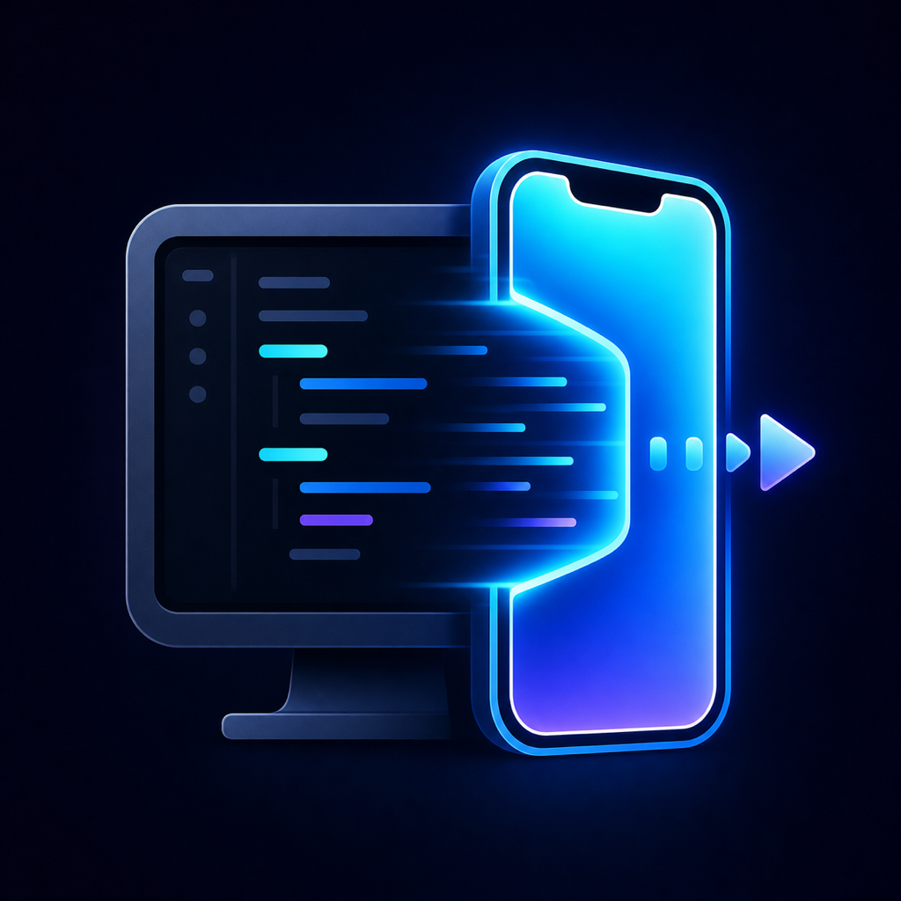

<p align="center">
  
</p>

<h1 align="center">Swift Sim</h1>

<p align="center">
  Preview Mac-hosted Xcode Simulators and install real iPhone builds while Codex works on the project.
</p>

<p align="center">
  <a href="LICENSE"></a>
  
  
</p>

Codex remains the only coding agent. Project code builds on the Mac. The iPhone companion either controls a Mac Simulator or opens a signed install page for a real device build. There is no Swift Sim account or cloud project import in V1.

## How It Works

Swift Sim has two lanes:

- **Preview in Simulator**: Codex launches your app on a Mac Simulator, verifies the same simulator in its sidebar, then returns an **Open Simulator in Companion App** link.
- **Install on iPhone**: Codex archives your project on the Mac, exports a signed `.ipa`, creates a temporary install page, then returns an **Install on iPhone** link.

The normal phone path uses headless H.264 from `serve-sim`, native iOS decoding, live touch input, hardware controls, logs, and immediate HID keyboard forwarding.

Device builds use your existing Apple development signing. Swift Sim installs over the existing app by default, so app data is preserved when the bundle identifier, signing team, and entitlements stay compatible.

## Requirements

- Apple silicon Mac
- Xcode with an iOS Simulator runtime
- Node.js 20 or newer
- Tailscale on the Mac and iPhone for simulator preview
- Apple Developer signing to install the companion from source
- Apple Developer signing for projects you want to install on iPhone

## Quick Start

This gets the local helper running and pairs one iPhone.

Clone the repository, then prepare the helper:

```sh
npm ci
npm run check
npm start
```

In another terminal, check remote access:

```sh
node mac-helper/bin/swift-sim-helper.js setup-status
```

If Tailscale Serve is not configured, expose the helper privately to your Tailnet:

```sh
tailscale serve 47217
```

Build the companion onto a connected iPhone:

```sh
DEVELOPMENT_TEAM=YOUR_TEAM_ID \
PRODUCT_BUNDLE_IDENTIFIER=com.yourname.SwiftSimCompanion \
./scripts/ios/run-on-device.sh
```

Generate a pairing link using the `suggestedRemoteBaseUrl` printed by `setup-status`:

```sh
node mac-helper/bin/swift-sim-helper.js pair \
  --remote-base-url https://your-mac.your-tailnet.ts.net
```

Open the printed link on the iPhone. The app needs no Swift Sim account or login.

After pairing, Codex can produce either:

- an **Open Simulator in Companion App** link for live simulator preview
- an **Install on iPhone** link for a signed device build/update

For the complete first-time flow, read [Setup](docs/SETUP.md).

## Codex Integration

The included Codex plugin teaches Codex to:

- build and verify the app in one selected Simulator
- open that same simulator in the Codex sidebar
- start or reuse the native companion session
- archive/export a real iPhone build
- return an authenticated install page for device builds
- preserve app data by avoiding uninstall/reinstall unless requested
- diagnose missing helper, Tailscale, pairing, and stream setup
- return the correct companion link after a successful run

The plugin source is at `plugins/swift-sim-companion`.

See [Codex Workflow](docs/CODEX_WORKFLOW.md) for installation and the exact handoff contract.

## Repository Layout

```text
Companion/                     Native SwiftUI iOS companion
mac-helper/                    Local session, stream, control, and device-build server
plugins/swift-sim-companion/  Codex workflow plugin
scripts/codex/                 Stable Codex session wrapper
scripts/ios/                   Physical-device build helper
test/                          Node helper tests
```

## Documentation

- [Setup](docs/SETUP.md): install, Tailscale, pairing, and first session
- [Codex Workflow](docs/CODEX_WORKFLOW.md): plugin installation and expected Codex behavior
- [Architecture](docs/ARCHITECTURE.md): components, transports, recovery, and session API
- [Security](docs/SECURITY.md): trust boundaries, tokens, and current limitations
- [Privacy](docs/PRIVACY.md): data handling, retention, deletion, and third-party services
- [Troubleshooting](docs/TROUBLESHOOTING.md): symptom-based recovery steps
- [Development](docs/DEVELOPMENT.md): tests, builds, validation, and contribution notes

## Current Limits

- Multi-touch fidelity depends on what the installed `serve-sim` version exposes. Do not assume pinch-to-zoom is complete.
- Universal links cannot be pre-entitled for every user's private `*.ts.net` hostname. The `swift-sim://` link is the reliable per-user fallback.
- Simulator session tokens do not yet expire or have a per-session deletion flow. Treat links as durable credentials and follow [Security](docs/SECURITY.md) if one is exposed.
- Device build install pages expire, but the generated `.ipa` is stored locally under `~/.swift-sim` until deleted.
- WebRTC is deferred. V1 uses AVCC H.264 over Tailscale with bounded decoder and encoder recovery.

## Security Summary

The helper binds to `127.0.0.1` by default. Tailscale Serve exposes it only inside the user's Tailnet. Pairing and session routes require opaque tokens, and public session responses omit project paths, local ports, process IDs, and Simulator UDIDs.

Read [Security](docs/SECURITY.md) before exposing the helper through anything other than private Tailscale Serve.

## License

Swift Sim is open source under the [Apache License 2.0](LICENSE).
