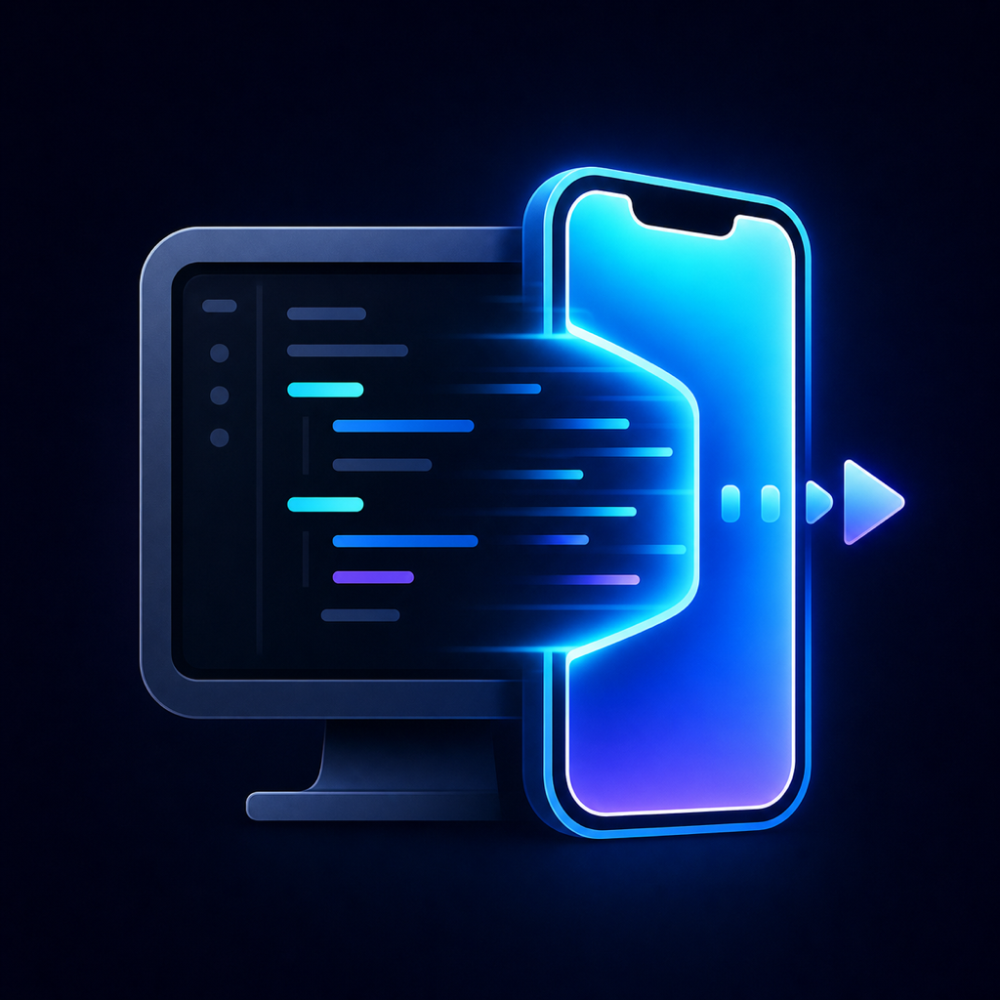
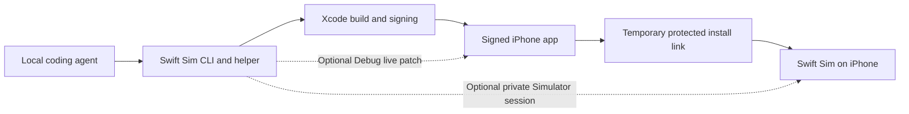

<p align="center">
  
</p>

<h1 align="center">Swift Sim</h1>

<p align="center">
  Build on your Mac from Codex, Cursor, Claude Code, or OpenCode, then install and test on your iPhone from anywhere.
</p>

<p align="center">
  <a href="LICENSE"></a>
  <a href="https://github.com/Miguelosaurus/Swift-Sim/actions/workflows/release.yml"></a>
  <a href="https://testflight.apple.com/join/HMUUFYNK"></a>
  
  
</p>

Swift Sim closes the remote iOS development loop. Your existing coding agent edits the project on your Mac, Xcode signs it with your Apple Developer account, and your iPhone receives a temporary **Open in Swift Sim to Install** link. For prepared Debug apps, compatible Swift and SwiftUI body edits can also patch the running app over a private Tailnet. The agent stays the agent; Swift Sim provides the build, delivery, change routing, app library, and optional Simulator companion.

Swift Sim is in public beta. The install workflow is usable today, but commands and stored state may still change between tagged releases. Run `swift-sim update` before reporting a problem.

## Quick Start

```sh
brew install miguelosaurus/tap/swift-sim
swift-sim setup
swift-sim doctor
```

Install the [iPhone companion from TestFlight](https://testflight.apple.com/join/HMUUFYNK), then ask a supported local coding agent:

```text
Build this app to my iPhone with Swift Sim
```

The detailed setup below explains signing, supported agents, updates, and the optional Simulator connection.

## How It Works


```mermaid
flowchart LR
    Agent["Local coding agent"] --> Helper["Swift Sim CLI and helper"]
    Helper --> Xcode["Xcode build and signing"]
    Xcode --> Build["Signed iPhone app"]
    Build --> Tunnel["Temporary protected install link"]
    Tunnel --> Phone["Swift Sim on iPhone"]
    Helper -. "Optional Debug live patch" .-> Build
    Helper -. "Optional private Simulator session" .-> Phone
```

Project source, Xcode credentials, and build work stay on the Mac. The temporary public route can download only one token-protected signed build; optional Simulator controls use the user's private Tailscale network.

## The Three Components

All three matter:

1. **Mac package** - the Homebrew CLI and background helper that drive Xcode.
2. **Agent integration** - the version-matched Swift Sim plugin or skill for Codex, Cursor, Claude Code, or OpenCode.
3. **iPhone app** - the native Swift Sim companion for build history, install status, and optional live Simulator control.

`swift-sim setup` connects the first two automatically. It detects supported coding agents already installed on the Mac and installs their Swift Sim integration from the same Homebrew release.

## Install

### 1. Prepare A Supported Agent

Use a local Mac session so the agent can reach Xcode and your signing credentials:

- **Codex:** run Codex on the Mac and continue it from the ChatGPT/Codex mobile app.
- **Cursor:** use Cursor 3.9 or newer, enable Remote Control in the Agents Window, and continue the local agent from Cursor for iOS.
- **Claude Code:** install Claude Code 2.1.51 or newer and start it with `claude remote-control` or `claude --remote-control`.
- **OpenCode:** use a local OpenCode session through the remote or mobile surface you already trust. OpenCode does not currently provide an official Swift Sim-specific mobile surface.

Do not move the task to a cloud agent. Swift Sim needs the coding agent to remain on the Mac where Xcode, the project, and the helper live.

### 2. Install The Mac Package And Agent Integration

```sh
brew install miguelosaurus/tap/swift-sim
swift-sim setup
```

Setup:

- starts the local helper as a background service
- installs or refreshes Swift Sim in every detected supported agent
- checks Xcode and signing readiness
- reports optional Simulator streaming separately

Run `swift-sim doctor` to see exactly which agent integrations are ready.

### 3. Install The iPhone Companion

[Install Swift Sim from TestFlight](https://testflight.apple.com/join/HMUUFYNK), then open it once so iOS can register the `swift-sim://` links.

The companion is recommended for the organized app library and required for live Simulator control. A normal device-build install link can still work in Safari if the companion is unavailable.

After an app has one successful device build, its app-history screen can also
trigger **Build Current Code**. The paired Mac reuses the private build recipe,
builds the project exactly as it currently exists on disk (including uncommitted
changes), and creates a fresh install link without a coding agent. Swift Sim
does not pull Git changes, switch branches, or edit the project. This trigger
works remotely from anywhere through the user's private Tailscale connection.
For first-time pairing, install Tailscale on both devices, give both internet
access, and sign in to the same Tailnet. They may use different Wi-Fi networks
or cellular. Pair them once, then keep Tailscale connected and the Mac awake so
its local Xcode can perform the build.
If the phone is not paired, tap **Pair Now**, then **Set Up With My Agent**.
Share the prepared request with Codex, Cursor, Claude Code, or OpenCode; the
agent checks the Mac, guides only the missing Tailscale step, and returns the
pairing link. For an interactive terminal handoff, first confirm
`swift-sim setup-status` reports `ok: true`, then run `swift-sim pair --qr` on
the Mac and scan the short-lived QR code from **Mac Connection → Scan Pairing
QR**. The invitation lasts five minutes by default; `--ttl-minutes 1..15` can
set a different window. The normal `swift-sim pair` command remains
machine-readable JSON for agents, and its universal/custom-scheme links remain
the manual fallback.
Opening the pairing link from Safari, Messages, or an agent opens Swift Sim
directly to **Mac Connection**. Swift Sim verifies the selected Mac and pairing
invitation before saving the credential; opening a link alone is not reported as
success. QR only bootstraps the pairing: both devices must still be signed in to
the same private Tailnet. QR invitations expire and can be used only once.

No USB cable is used for companion pairing, remote builds, Simulator preview,
or OTA installation. A cable may be needed separately if Xcode asks to trust or
register a new iPhone for its first development-signed build.

No Swift Sim account, Cloudflare account, repository clone, or manual plugin copy is required.

## Build To Your iPhone

From the local agent session, ask:

```text
Build this app to my iPhone with Swift Sim
```

The agent runs the installed Swift Sim workflow, signs the app, and returns **Open in Swift Sim to Install**. Swift Sim saves the version before asking iOS to install it. The link works over cellular or any network and lasts two hours by default. If it expires, the app can generate a new link from the saved app while the trusted Mac is online. Tailscale is not required for the install itself.

**Build Current Code** creates a new signed IPA from the current Mac working
tree. **Create New Install Link** reuses the already-saved IPA and does not
include newer source changes. Normal install links do not require Tailscale;
initiating a new Xcode build from the phone does, because it is a private remote
command to the user's Mac.

If Swift Sim is not installed, the HTTPS page still offers **Install directly**. That option installs the signed app but cannot add the version to Swift Sim's history.

Building the same bundle again updates the existing app and preserves its container when the bundle identifier, Apple team, and entitlements remain compatible. Swift Sim keeps one library card per app and adds each update to that app's build history.

## Optional Remote Hot Reload

Swift Sim can accelerate an already-installed Debug app without turning it into a livestream or requiring the iPhone to share Wi-Fi with the Mac. `swift-sim setup` installs and manages a private, headless live engine; users do not install, open, or configure another Mac app. Compatible same-team-signed patches travel directly to the running app over the user's private Tailscale connection.

This path is validated end to end on a physical iPhone across 24 supported smoke edits and their restores, with zero fallbacks or timeouts and sub-second median latency in each UI/state workload. A supplemental 27-case Liquid Glass capability corpus also completed its focused physical gate with 27/27 edits and 27/27 restores, zero fallbacks/timeouts, and 724 ms median latency (930 ms p95). These results prove the named mechanisms and categories, not a universal percentage of app edits. Swift Sim still classifies every change and rebuilds when live Swift metadata would change.

The native SwiftUI system-surface corpus extends that proof across menus,
presentations, navigation, controls, lists, forms, search, and toolbars: 24/24
curated hot edits and 24/24 restores completed on the physical fixture with
zero fallback, timeout, or partial-application records (1,010 ms median,
1,214 ms p95). See [the native-surface evidence](docs/NATIVE_SYSTEM_SURFACE_HOT_RELOAD.md)
for the exact scope and build boundaries.

A separate mechanism corpus now covers fourteen less-obvious replacement
shapes—protocol defaults, actor and extension members, `ViewModifier`,
Observation, explicit accessors, property-wrapper getters, initializers,
subscripts, generic and parameterized helpers, async/throws helpers, and UIKit
bridge callbacks. All 14/14 curated hot edits and restores were semantically
observed on a physical iPhone; two transient patch timeouts were automatically
recovered from fresh live sessions (p50 665 ms, p95 1,713 ms). Initializer and
subscript edits use a narrow body-local literal fold when their result is
consumed directly by a replaceable SwiftUI body; arbitrary metadata changes
still produce a normal build decision. See [the mechanism evidence](docs/HOT_RELOAD_MECHANISM_COVERAGE.md)
for the exact denominator and the three rebuild controls.

For implementation-only multi-file edits, Swift Sim compiles all dynamic
replacements into one signed bundle and sends one engine request, so the live
operation is reported as genuinely atomic. Async/interposed members retain a
sequential fallback because the runtime itself owns their replacement path.
Transient transport failures get one bounded session-recovery attempt before
Swift Sim returns the ordinary signed build link; compile failures and partial
applications are never retried automatically.

The coding agent adds the `SwiftSimLive` package and one `.swiftSimLive()` modifier at the app's root view as a one-time project change. The user does not operate the engine or scatter Swift Sim code through the app. Release builds make the modifier a no-op.

The coding-agent integration runs `swift-sim deliver-change` once per completed
logical edit to choose the safe path:

- Compatible implementation and SwiftUI body edits are attempted when the live lane is connected. SwiftUI changes use compiler-supported dynamic replacement and count as successful only after the running app acknowledges a new root revision.
- Stored properties, type shape, function signatures, imports, packages, resources, assets, configuration, entitlements, and signing changes create a fresh signed update link.
- If compilation, delivery, runtime replacement, or root refresh cannot be proved within a few seconds, the agent falls back to a normal build.
- Multi-file implementation edits can reload in one routed operation. If any changed file crosses a structural boundary, the entire edit uses a fresh signed update instead.

The normal warm loop does not run doctor, live-status, screenshots, or UI
analysis before each edit. `route-change` remains available for compatibility,
diagnostics, and benchmark tooling.

This is a development feature, not downloadable-code support for App Store builds. It requires one initial live-enabled Debug install and Tailscale on both devices. See [Setup](docs/SETUP.md) for the one-time preparation.

## Optional Live Simulator

For a faster visual loop, ask:

```text
Open a live Simulator preview in Swift Sim
```

Live Simulator control requires Tailscale on the Mac and iPhone because interactive controls remain private to your Tailnet. Same Wi-Fi is not required.

## Requirements

### iPhone installs

- Apple silicon Mac
- Xcode and an Apple Developer account configured in Xcode
- Homebrew
- Codex, Cursor, Claude Code, or OpenCode running locally on the Mac
- iPhone included by the development or ad-hoc provisioning profile

### Optional Simulator preview

- An iOS Simulator runtime in Xcode
- Tailscale on the Mac and iPhone
- Swift Sim on the iPhone

### Optional remote hot reload

- A live-enabled Debug build installed and running on the iPhone
- Tailscale on the Mac and iPhone
- The same Apple development signing team for the app and injected patches

## What Runs Where

- **Coding agent:** edits and orchestrates from the Mac; mobile is its remote-control surface.
- **Mac helper:** builds, signs, serves install artifacts, and manages Simulator sessions.
- **iPhone:** installs the signed app or views and controls the Mac Simulator.
- **Cloudflare Quick Tunnel:** temporarily carries only token-protected build downloads.
- **Tailscale Serve:** carries only optional private Simulator traffic.
- **Private Tailnet route:** carries optional Debug-only live patches directly from the Mac to the running app.

Swift Sim never reads or transmits your Apple ID password. Xcode owns signing credentials and provisioning.

## Documentation

- [Setup](docs/SETUP.md): install the three components and make the first build
- [Agent Workflows](docs/AGENT_WORKFLOWS.md): Codex, Cursor, Claude Code, and OpenCode behavior
- [Security](docs/SECURITY.md): signing, tokens, network boundaries, and expiry
- [Troubleshooting](docs/TROUBLESHOOTING.md): symptom-based fixes
- [Architecture](docs/ARCHITECTURE.md): helper, delivery, and Simulator transports
- [Development](docs/DEVELOPMENT.md): contributor-only source workflow
- [Liquid Glass Hot Reload](docs/LIQUID_GLASS_HOT_RELOAD.md): focused API coverage and proof boundaries
- [Privacy](docs/PRIVACY.md): data handling and third parties
- [Changelog](CHANGELOG.md): notable changes by release

## Current Limits

- Quick Tunnel links are temporary and have no uptime guarantee. Generate a new build if one ends early.
- iOS does not report OTA install completion to another app. The Mac helper confirms requested installs automatically when the paired iPhone is available over the local network or USB, and the companion syncs that result when opened.
- Simulator multi-touch fidelity depends on the pinned `serve-sim` transport.
- Remote hot reload cannot change live Swift metadata. Structural and non-Swift changes still require a new build.
- Remote hot reload is Debug-only and requires the app to remain running and reachable through Tailscale.
- Cursor and Claude mobile workflows must control a local Mac agent session; their cloud agents cannot access your Mac's Xcode environment.

## Contributing

The repository is the single source for the Homebrew package, helper, shared agent skill, native agent manifests, and iPhone companion. End users should use Homebrew so every installed component stays version-matched.

All supported agent integrations are public and install from the same tagged Homebrew package through `swift-sim setup`. There are no separate private plugin repositories or manual local-plugin copies.

Read [CONTRIBUTING.md](CONTRIBUTING.md) before opening a pull request. Community participation follows the [Code of Conduct](CODE_OF_CONDUCT.md), and vulnerabilities should be reported privately using [SECURITY.md](SECURITY.md).

Swift Sim is open source under the [Apache License 2.0](LICENSE).
