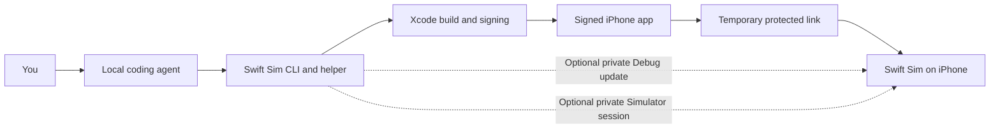

<p align="center">
  
</p>

<h1 align="center">Swift Sim</h1>

<p align="center">
  Build iPhone apps with the coding agent on your Mac. Install and test them on your iPhone from anywhere.
</p>

<p align="center">
  <a href="LICENSE"></a>
  <a href="https://github.com/Miguelosaurus/Swift-Sim/actions/workflows/release.yml"></a>
  <a href="https://testflight.apple.com/join/HMUUFYNK"></a>
  
  
</p>

Swift Sim closes the loop between a coding agent, Xcode, and a real iPhone. Codex, Cursor, Claude Code, or OpenCode edits the project on your Mac. Xcode builds and signs the app. Swift Sim delivers it to your iPhone and keeps its build history organized.

For prepared Debug apps, Swift Sim can also apply compatible Swift and SwiftUI edits to the running app over your private Tailnet. Structural changes automatically use a new signed build.

Swift Sim is in public beta. Commands and stored state can change between tagged releases.

## Why Swift Sim

- **Test the real app.** Install a normal Xcode-signed IPA on your iPhone. This is not a streamed phone or a web preview.
- **Work from anywhere.** Continue the coding agent that already runs on your Mac, then open the install link on any iPhone network.
- **Keep app data and history.** Compatible updates install over the existing app. Swift Sim groups builds under one app.
- **Iterate faster when it is safe.** Compatible Debug implementation edits can update the running app. Other changes fall back to a signed build.
- **Keep control of your source and credentials.** Project files, Apple credentials, builds, and signing stay on your Mac.

## Quick Start

Install the Mac package:

```sh
brew install miguelosaurus/tap/swift-sim
swift-sim setup
swift-sim doctor
```

[Install the iPhone companion from TestFlight](https://testflight.apple.com/join/HMUUFYNK). Then ask a supported local coding agent:

```text
Build this app to my iPhone with Swift Sim
```

Open **Open in Swift Sim to Install** on your iPhone and tap **Install**.

That is the complete normal workflow. Tailscale is not required for iPhone installation.

Read [Setup](docs/SETUP.md) for signing requirements, supported agents, pairing, and optional features.

## One Product, Two Iteration Paths

| Change | Swift Sim action | What you do on the iPhone |
| --- | --- | --- |
| First install | Create a signed build | Open the link and install |
| Structural, resource, package, or signing change | Create a new signed build | Open the update link |
| Compatible implementation or SwiftUI body edit | Update the running Debug app | Test immediately |
| Live update cannot be proved | Create a new signed build | Open the fallback link |

The coding agent chooses the safe path with `swift-sim deliver-change`. You do not have to classify the edit or operate a separate injection application.

Remote hot reload requires a prepared development-signed Debug build and Tailscale on the Mac and iPhone. It is never enabled for Release, TestFlight, or App Store builds. See [Remote Hot Reload](docs/SETUP.md#optional-remote-iphone-hot-reload).

Physical-iPhone test corpora cover common SwiftUI surfaces, Liquid Glass, state changes, helpers, accessors, and UIKit bridges. The results prove those named cases; they do not claim that every Swift edit can reload. See [Hot Reload Evidence](docs/evidence/README.md).

## Build Again From Your iPhone

After one successful device build, pair the companion with the Mac. You can then tap **Build Current Code** in Swift Sim.

The trusted Mac builds the project exactly as it exists on disk, including uncommitted changes. Swift Sim does not pull Git changes, switch branches, or edit the project. It rejects the build if the app identity changes.

**Create New Install Link** is different. It republishes a saved IPA and does not compile current source.

This private remote command requires Tailscale, a paired Mac, and the Mac helper. The resulting install link does not require Tailscale.

## Optional Live Simulator

Ask your local coding agent:

```text
Open a live Simulator preview in Swift Sim
```

The Simulator runs on the Mac. The iPhone companion displays it and sends controls through your private Tailnet. Same Wi-Fi is not required.

## How It Works


```mermaid
flowchart LR
    User["You"] --> Agent["Local coding agent"]
    Agent --> Helper["Swift Sim CLI and helper"]
    Helper --> Xcode["Xcode build and signing"]
    Xcode --> Build["Signed iPhone app"]
    Build --> Link["Temporary protected link"]
    Link --> Phone["Swift Sim on iPhone"]
    Helper -. "Optional private Debug update" .-> Phone
    Helper -. "Optional private Simulator session" .-> Phone
```

Swift Sim has three components:

1. The Homebrew CLI and Mac helper drive Xcode and delivery.
2. The agent integration teaches supported coding agents the exact workflow.
3. The native iPhone companion manages apps, builds, installation status, pairing, and Simulator sessions.

`swift-sim setup` installs the Mac package and agent integrations from one version-matched release. The iPhone companion is distributed through TestFlight.

## Local-First Security

- Xcode owns Apple credentials and provisioning.
- The full helper listens on Mac localhost.
- Temporary public delivery exposes only one token-protected signed build.
- Pairing, **Build Current Code**, Simulator controls, and Debug updates use the private Tailnet.
- Swift Sim does not operate an account, source-code service, artifact store, analytics service, or advertising service.

Read [Security](docs/SECURITY.md) and [Privacy](docs/PRIVACY.md) for the full boundaries.

## Requirements

For iPhone builds:

- Apple silicon Mac
- Xcode with an Apple Developer account
- Homebrew
- Codex, Cursor, Claude Code, or OpenCode running locally on the Mac
- iPhone included in the development or ad-hoc provisioning profile

Optional private features also require Tailscale on the Mac and iPhone.

## Current Limits

- Swift Sim is a public beta.
- Temporary delivery links can expire or end early. Create a new link or build when this occurs.
- iOS does not report OTA installation completion to another app. Swift Sim reports **Installed** only after the Mac helper verifies the exact version on a reachable iPhone.
- Remote hot reload cannot change live Swift metadata. Structural and non-Swift changes require a new build.
- Remote hot reload requires a running, prepared Debug app.
- Mobile workflows must continue an agent session that runs on the Mac. A cloud agent cannot use the Mac's Xcode environment.

## Documentation

Start at the [Documentation Guide](docs/README.md).

- [Setup](docs/SETUP.md): install Swift Sim and create the first iPhone build
- [Troubleshooting](docs/TROUBLESHOOTING.md): symptom-based recovery steps
- [Agent Workflows](docs/AGENT_WORKFLOWS.md): Codex, Cursor, Claude Code, and OpenCode behavior
- [Architecture](docs/ARCHITECTURE.md): components, transport paths, and data models
- [Security](docs/SECURITY.md): trust boundaries, tokens, signing, and network exposure
- [Development](docs/DEVELOPMENT.md): contributor workflow and release validation
- [Changelog](CHANGELOG.md): notable changes by release

## Contributing

The repository is the source of truth for the helper, CLI, agent integrations, iPhone companion, and documentation. Changes must keep those layers aligned.

Read [Contributing](CONTRIBUTING.md) before opening a pull request. Follow the [Code of Conduct](CODE_OF_CONDUCT.md). Report vulnerabilities through the private process in [Security Policy](SECURITY.md).

Swift Sim is open source under the [Apache License 2.0](LICENSE).
