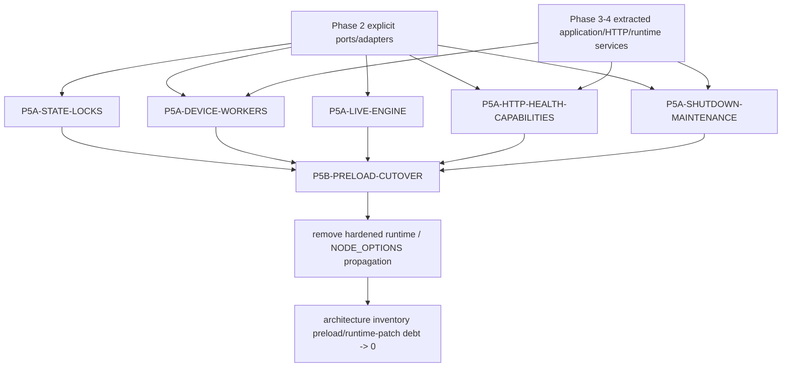

# P5-PRELOAD-INVENTORY

Status: **PREPARATORY INVENTORY COMPLETE**
Class: **preparatory**
Phase: **5**
Dispatch base: `38eee4bfb1eabc2184d92aa3e52fee28b139cbf5`
Assigned branch: `agent/arch-ws-P5-PRELOAD-INVENTORY-preload-map`

## Goal and guardrails

Characterize the current preload/runtime-patch surface and produce the dependency/ownership map needed by the later Phase 5 implementation wave.

This workstream is analysis/documentation only. It does **not** remove a preload, change runtime behavior, move production authority, or edit the canonical roadmap/registry/progress/current handoff. The inventory below is derived from the dispatch tree rather than the older Phase 5 checkpoint count.

No new executable inventory fixture is added here. The existing `scripts/architecture/inventory.js` already supports exact-commit collection, scans both `mac-helper/src` and `mac-helper/bin`, classifies patch evidence and preload/boundary import coupling, and is enforced by `scripts/architecture/baseline-policy.json`. Adding a second scanner would create a competing definition of the same debt rather than improve repeatability.

## Method and exact current count

At the dispatch base, `scripts/architecture/inventory.js` classifies a production module as `preloadRuntimePatchModules` when its basename/import graph matches the preload/runtime-boundary family or its source contains global/prototype/builtin monkey-patch evidence. The baseline policy has an empty allowlist for this category and a current cap containing the exact observed set. The hosted `verify` check passed for the dispatch SHA, so a stale cap or an unrecorded current module would have failed architecture verification.

**Current architecture-inventory count: 30 modules.**

The older Phase 5 checkpoint count of 13 preload files is therefore stale and must not be used for planning.

For planning, the 30 scanner entries break down semantically as follows. These are planning classifications, not new policy categories:

| Planning class | Count | Meaning |
| --- | ---: | --- |
| Bootstrap/install/propagation and entry wrappers | 7 | Four process entrypoints plus `hardenedRuntimePreload.js`, `runtimePreloadOptions.js`, and `swiftSimChildRuntimeBoundary.js`. |
| Global process/fs/http/fetch patch installers | 12 | Runtime shims that replace builtin/global behavior directly. |
| Compatibility/lifecycle patch adapters | 2 | Prototype/signal shims that bridge legacy lifecycle behavior to newer services. |
| Patch-dependent consumers | 9 | Production modules pulled into the scanner because they import a patch module or directly depend on a preload-owned primitive. |
| **Total** | **30** | Exact dispatch-tree scanner set. |

## Exact current inventory

| # | Module | Planning class | What it currently replaces/intercepts | Primary call site / owner | Existing replacement capability | Removal blocker / required proof |
| ---: | --- | --- | --- | --- | --- | --- |
| 1 | `mac-helper/bin/swift-sim-device-delivery.js` | bootstrap/consumer | Delivery entrypoint statically installs lock behavior; hardened child boot additionally supplies command deadline, atomic lock removal, and gateway-health fetch behavior. | Device-delivery process composition. | `CommandRunner`, `ProcessSupervisor`, `LockManager`, explicit health client/runtime ports. | Delivery startup/health/state/process paths must be explicit before child preload propagation can disappear. |
| 2 | `mac-helper/bin/swift-sim-device-gateway.js` | bootstrap/consumer | Gateway entrypoint statically installs lock and capability interception while its legacy HTTP listener also implements public device-build endpoints. | Public device gateway composition. | Phase 3/4 capability application service/routes, `RequestOriginPolicy`, explicit HTTP runtime. | Remove duplicate interception only after one explicit route owner preserves authorization/status/log/install/verify behavior. |
| 3 | `mac-helper/bin/swift-sim-entry.js` | bootstrap/entry | CLI entrypoint installs command, lock, worker, artifact, live-engine, child-runtime, and compatible helper-health behavior before loading legacy CLI code. | Main CLI composition root. | Phase 2 ports/adapters plus extracted CLI/helper-control application services. | Shared composition-root edit; must be cut over after domain workers no longer require global patches. |
| 4 | `mac-helper/bin/swift-sim-helper-entry.js` | bootstrap/entry | Helper entrypoint installs the broad helper preload stack, HTTP boundary, service shutdown behavior, and legacy compatibility dispatch. | Helper process composition root. | `helperEntrypoint`, helper CLI/runtime controllers, HTTP application services, Phase 2 infrastructure container. | Central red-zone-like composition hotspot for Phase 5; must be owned by one dependent cutover worker. |
| 5 | `mac-helper/src/artifactCleanupBoundaryPreload.js` | compatibility adapter | Replaces `DeviceBuildStore.prototype.drainArtifactCleanupJobs` with path-fenced cleanup/retry behavior. | Device-build maintenance callers through `DeviceBuildStore`. | `NodeDeviceBuildArtifactUsage`, `NodeArtifactStore`, `DeliveryMaintenanceCoordinator`, retention/cleanup services. | Maintenance callers still expect the prototype surface; explicit cleanup ownership and retry parity must be wired first. |
| 6 | `mac-helper/src/asyncCommandGroupPreload.js` | global patch | Replaces `child_process.spawn` behavior for `tailscale` so it owns a process group and group kill is enforced. | Helper/tailscale backend execution. | `NodeCommandRunner` and `NodeProcessSupervisor`. | Tailscale call sites must request process-group ownership explicitly and preserve cancellation/kill semantics. |
| 7 | `mac-helper/src/atomicLockRemovalPreload.js` | global patch | Wraps `fs.rmSync` for lock directories so deletion is rename-to-quarantine then remove, closing a reclaim race. | All processes using legacy lock-directory deletion. | `NodeLockManager` stale-lock claim/quarantine/release machinery. | Every remaining hand-rolled lock user must be on `LockManager`; parity must preserve ownership rejection plus quarantine-before-delete. |
| 8 | `mac-helper/src/cliRuntimeBoundary.js` | global patch / compatibility | Patches compatible helper-health `fetch`; also owns legacy helper process detection/start/stop/reconciliation through raw process/fs tooling and process-env state. | CLI helper lifecycle/control. | Helper-control application service, helper service lifecycle abstractions, `CommandRunner`, `ProcessSupervisor`, explicit health client. | Eliminate global fetch/env compatibility and move all helper lifecycle call sites onto explicit service APIs. |
| 9 | `mac-helper/src/commandDeadlinePreload.js` | global patch | Wraps `spawnSync`/`execFileSync` with command-specific deadlines, detached groups, timeout cleanup, and SIGKILL fallback. | Broad direct `child_process` callers. | `NodeCommandRunner`, `NodeProcessSupervisor`, `NodeProcessControl`. | Direct command call sites must supply explicit timeout/process-group policy; current command-specific defaults cannot simply vanish. |
| 10 | `mac-helper/src/deviceBuildCapabilityBoundaryPreload.js` | global patch | Wraps `http.createServer` to intercept public device-build capability/status/log/link/install/verify routes and capability authorization. | Helper/gateway HTTP server bootstrap. | `deviceBuildCapabilityApplicationService.js`, `deviceBuildCapabilityRoutes.js`, public gateway authorization services. | Explicit server composition must become the sole owner and route precedence/status shapes must be characterized first. |
| 11 | `mac-helper/src/deviceBuilder.js` | patch-dependent consumer | Imports lock ownership globally; relies on durable cancellation/worker journal semantics and process identity around device builds. | Device build execution/recovery. | `AtomicFileStore`, `RuntimeJournalStore`, `ProcessSupervisor`, `CommandRunner`, device-build runtime controller. | Migrate durable writes/worker launch/recovery to ports without weakening cancellation, timeout, retry, or journal ordering. |
| 12 | `mac-helper/src/deviceDeliveryState.js` | patch-dependent consumer | Imports lock ownership around its own state lock, atomic temp/rename state writes, and process identity. | Delivery state persistence. | `NodeLockManager`, `NodeAtomicFileStore`, `NodeRuntimeJournalStore`. | Replace hand-rolled lock/write semantics and preserve cross-process state recovery. |
| 13 | `mac-helper/src/deviceInventory.js` | patch-dependent consumer | Imports lock ownership while executing `devicectl` and managing inventory/cache/temp state. | Device inventory adapter. | `CommandRunner`, `AtomicFileStore`, artifact/temp helpers. | The exact behavior still obtained from the global lock import is not isolated; characterize it or prove the import is dead before removal. |
| 14 | `mac-helper/src/gatewayHealthFetchBoundary.js` | global patch | Replaces global `fetch` behavior for loopback `/health`, sets/uses a gateway-health nonce in `process.env`, and synthesizes 503 on role/nonce mismatch. | Device-delivery process checking gateway health. | Explicit runtime-health inspector/client plus request-origin/runtime identity data passed as values. | Preserve role/nonce fencing without global fetch or global environment mutation. |
| 15 | `mac-helper/src/hardenedRuntimePreload.js` | bootstrap/router | Selects and installs a script-specific ordered preload stack based on `process.argv[1]`. | `NODE_OPTIONS --import` for Swift-Sim child processes. | Later explicit composition roots; Phase 2 runtime container. | Cannot be removed until every child path has explicit dependencies and no global patch semantics remain. |
| 16 | `mac-helper/src/helperHttpBoundaryPreload.js` | global patch / compatibility bridge | Captures the then-current `http.createServer` and replaces it with `HelperHttpBoundaryRuntime`, delegating to extracted Phase 3/4 handlers/coordinators while preserving legacy listener fallback. | Helper HTTP server creation. | `HelperHttpBoundaryRuntime`, `DeliveryMaintenanceCoordinator`, extracted handlers/services, `LoopbackRequestOriginPolicy`. | New services already exist, but helper server composition still enters through interception rather than constructor/composition injection. |
| 17 | `mac-helper/src/helperShutdownDeadlinePreload.js` | global process patch | Installs signal handling and wraps `process.exit` so nonzero exit is delayed during shutdown, with a forced hard-exit deadline. | Helper service mode. | Explicit helper/session shutdown lifecycle and process-control policy. | Need characterization of early `process.exit`, graceful drain, hard deadline, and interaction with renewal cancellation. |
| 18 | `mac-helper/src/liveEngineLifecycleLock.js` | patch-dependent consumer | Uses `NodeLockManager` explicitly but imports kernel identity from `liveEngineOwnershipPreload.js`. | Live-engine lifecycle mutual exclusion. | `NodeLockManager`; process identity authority used by `NodeProcessSupervisor`. | Extract process identity from preload ownership so lock code no longer imports a patch installer. |
| 19 | `mac-helper/src/liveEngineOwnershipPreload.js` | global patch | Wraps `spawn`, `fs.writeFileSync`, `fs.readFileSync`, and `process.kill`; establishes kernel/executable/start-token identity; journals live-engine ownership; authorizes exact-process/group termination; prepares a Darwin identity helper. | Live reload/live engine process ownership. | `NodeProcessSupervisor`, `NodeProcessControl`, `NodeRuntimeJournalStore`, `darwinLegacyProcessIdentity.js`. | Highest-risk extraction: PID reuse, executable identity, process-group fencing, journal rollback, and unauthorized stop behavior need parity through explicit services. |
| 20 | `mac-helper/src/liveReload.js` | patch-dependent consumer | Imports live-engine lock/abort primitives supplied by preload-owned process identity/ownership behavior. | Live reload orchestration. | `ProcessSupervisor`, `ProcessControl`, `RuntimeJournalStore`, `LockManager`. | Rewire engine spawn/stop/recovery to explicit supervisor and identity authority. |
| 21 | `mac-helper/src/lockOwnershipPreload.js` | global patch | Wraps `fs.existsSync`, `fs.writeFileSync`, `fs.rmSync`, and `fs.renameSync`; supplies owner/fence/journal durability and live-process ownership checks. | Legacy lock/journal/state writers across helper, delivery, gateway, builder, session, simulator lifecycle. | `NodeLockManager`, `NodeAtomicFileStore`, `NodeRuntimeJournalStore`, explicit process identity. | All remaining hidden consumers must move to explicit stores/leases; special cancellation/worker journal rules must be modeled rather than lost. |
| 22 | `mac-helper/src/ownedWorkerIdentity.js` | patch-dependent consumer | Imports kernel/worker identity preparation from `liveEngineOwnershipPreload.js` for durable owned-worker records. | Owned worker identity/journaling. | `NodeProcessSupervisor` process identity authority and `RuntimeJournalStore`. | Move identity helpers to a non-preload service shared by worker and live-engine supervision. |
| 23 | `mac-helper/src/ownedWorkerPreload.js` | global patch | Wraps `spawn` for detached `xcodebuild`/shell workers and `fs.writeFileSync` for `.worker.json`; starts a supervisor and releases a readiness handshake only after durable journal publication. | Device-build owned workers. | `NodeProcessSupervisor` already captures identity and publishes a journal before returning supervised process state. | Need end-to-end proof that explicit supervisor preserves journal-before-exec/readiness and recovery semantics. |
| 24 | `mac-helper/src/renewalShutdownPreload.js` | compatibility/lifecycle adapter | Prepends SIGTERM/SIGINT handling and cancels pending renewal builds during helper service shutdown. | Helper service-mode shutdown. | `DeviceBuildRuntimeController`, explicit helper shutdown/maintenance coordinator. | Move cancellation into owned lifecycle orchestration and preserve ordering with hard shutdown deadline. |
| 25 | `mac-helper/src/runtimeHealthPreload.js` | global patch | Wraps `http.createServer` and intercepts GET `/health` to return role-specific runtime health. | Helper and gateway server boot. | Explicit health handler/runtime composition and request context. | Health must become an ordinary owned route before global server interception is deleted. |
| 26 | `mac-helper/src/runtimePreloadOptions.js` | bootstrap/propagation | Rewrites `NODE_OPTIONS` to add/replace Swift-Sim's `--import=<hardenedRuntimePreload>` entry. | Child-runtime environment construction. | Explicit entrypoint composition makes preload propagation unnecessary. | Delete only after no Swift-Sim child requires hardened preload; preserve unrelated existing `NODE_OPTIONS`. |
| 27 | `mac-helper/src/sessionStoreBase.js` | patch-dependent consumer | Imports global lock ownership around hand-rolled session JSON locking/atomic writes. | Session state store compatibility path. | `NodeLockManager`, `NodeAtomicFileStore`; Phase 4 repository work where applicable. | Explicitly preserve the current domain/compatibility authority while replacing filesystem mechanics; do not assume all session state is already migrated. |
| 28 | `mac-helper/src/simulatorLifecycle.js` | patch-dependent consumer | Imports global lock ownership around durable simulator lifecycle claims/recovery. | Simulator lifecycle domain. | `LockManager`, `AtomicFileStore`, `RuntimeJournalStore`. | Move lifecycle mechanics to explicit ports while preserving domain claim/recovery behavior. |
| 29 | `mac-helper/src/simulatorLifecycleBase.js` | patch-dependent consumer | Imports global lock ownership around lifecycle state/lock/atomic-file operations. | Simulator lifecycle base implementation. | `LockManager`, `AtomicFileStore`, `RuntimeJournalStore`. | Same lifecycle migration must land atomically with `simulatorLifecycle.js` to avoid split lock semantics. |
| 30 | `mac-helper/src/swiftSimChildRuntimeBoundary.js` | bootstrap/global patch | Wraps `child_process.spawn` and `spawnSync` for raw Swift-Sim helper/device-delivery/device-gateway Node children and injects hardened runtime through `NODE_OPTIONS`. | Parent processes spawning Swift-Sim Node children. | Explicit child entrypoint dependencies/composition. | Final propagation seam; removal is downstream of all child-service cutovers and shared wrapper-order characterization. |

## Replacement capabilities already available from Phases 2–4

ADR-0002 established explicit infrastructure ports specifically to eliminate these hidden runtime contracts. The dispatch tree already contains production adapters for the important primitive families:

- `CommandRunner` -> `mac-helper/src/infrastructure/nodeCommandRunner.js`
- `ProcessSupervisor` -> `mac-helper/src/infrastructure/nodeProcessSupervisor.js`
- process termination/control -> `mac-helper/src/infrastructure/nodeProcessControl.js`
- `AtomicFileStore` -> `mac-helper/src/infrastructure/nodeAtomicFileStore.js`
- `LockManager` -> `mac-helper/src/infrastructure/nodeLockManager.js`
- `RuntimeJournalStore` -> `mac-helper/src/infrastructure/nodeRuntimeJournalStore.js`
- `ArtifactStore` -> `mac-helper/src/infrastructure/nodeArtifactStore.js`
- device-build artifact accounting -> `mac-helper/src/infrastructure/nodeDeviceBuildArtifactUsage.js`
- request-origin policy -> `mac-helper/src/infrastructure/loopbackRequestOriginPolicy.js`
- explicit runtime composition -> `mac-helper/src/infrastructure/runtimeContainer.ts`
- process identity compatibility -> `mac-helper/src/infrastructure/darwinLegacyProcessIdentity.js`
- structured logging/clock/id generation -> `structuredLogger.js`, `systemClock.js`, `systemIdGenerator.js`

Phases 3–4 also extracted higher-level ownership from the legacy listeners/CLI: helper entrypoint/CLI runtimes, session and device-build runtime controllers, helper-control application services/routes, device-build capability application services/routes, helper HTTP handlers/request context, `HelperHttpBoundaryRuntime`, `DeliveryMaintenanceCoordinator`, persistence adapters, and SQLite repositories. Phase 5 should wire those services directly rather than inventing parallel replacements.

Two particularly important parity facts are already embodied by the explicit adapters:

1. `NodeLockManager` owns stale-lock detection, reclaim claims, quarantine, owner identity, and atomic owner publication. It is the intended replacement for the combined `atomicLockRemovalPreload.js` + `lockOwnershipPreload.js` behavior, not merely a thin mutex.
2. `NodeProcessSupervisor` captures strong worker/live-engine/delivery identity, publishes runtime journals, rolls back failed publication, inspects identity before termination, and supports process-group termination. It is the intended replacement for much of `ownedWorkerPreload.js`, `liveEngineOwnershipPreload.js`, and child-process ownership behavior.

## Import-order and runtime coupling

Phase 5 cannot safely delete modules alphabetically because the current behavior is an ordered wrapper stack.

### Child bootstrap chain

```text
runtimePreloadOptions.js
        ^
        | used by
swiftSimChildRuntimeBoundary.js
        |
        | rewrites child NODE_OPTIONS
        v
hardenedRuntimePreload.js
        |
        +-- helper stack
        +-- device-gateway stack
        `-- device-delivery stack
```

`hardenedRuntimePreload.js` routes on the launched script basename. The current install order is behaviorally relevant:

```text
helper:
  commandDeadline
  -> asyncCommandGroup
  -> helperShutdownDeadline (service mode)
  -> atomicLockRemoval
  -> lockOwnership
  -> ownedWorker
  -> runtimeHealth
  -> deviceBuildCapability
  -> helperHttpBoundary
  -> artifactCleanupBoundary
  -> compatible helper-health fetch
  -> liveEngineOwnership
  -> swiftSimChildRuntimeBoundary
  -> renewalShutdown (service mode)

gateway:
  commandDeadline
  -> atomicLockRemoval
  -> lockOwnership
  -> runtimeHealth
  -> artifactCleanupBoundary

delivery:
  commandDeadline
  -> atomicLockRemoval
  -> gatewayHealthFetchBoundary
```

The static entrypoints also install overlapping subsets, so both direct process startup and inherited `NODE_OPTIONS` startup need to remain equivalent during migration.

### Wrapper composition that must be preserved or deliberately replaced

- On the helper spawn path, later wrappers capture earlier implementations. The effective `spawn` stack is approximately `swiftSimChildRuntimeBoundary -> liveEngineOwnershipPreload -> ownedWorkerPreload -> asyncCommandGroupPreload -> native spawn` for matching calls. `swiftSimChildRuntimeBoundary.js` explicitly documents its need to compose with the already-installed live-engine ownership wrapper.
- `spawnSync` similarly composes child-runtime propagation outside command-deadline behavior.
- `lockOwnershipPreload.js` installs after `atomicLockRemovalPreload.js`, so ownership validation is outside quarantine-before-delete. An explicit `LockManager` migration must preserve **both** properties.
- HTTP server construction is layered: runtime health is installed before capability interception; helper HTTP boundary then captures the already-wrapped `createServer`. Thus health/capability/helper route precedence is currently partly encoded in install order.
- Helper shutdown has two signal-level concerns: hard deadline/process-exit control and renewal-build cancellation. Their listener ordering is part of observable shutdown behavior.
- Owned-worker launch has a hidden journal/readiness contract: the supervisor cannot let the worker proceed as if owned until the durable `.worker.json` identity is published.
- Live-engine lifecycle modules directly import identity helpers from a preload file, so deleting the preload also requires relocating those non-patch primitives to an explicit identity/service module.
- Gateway health validation encodes expected role plus nonce through global `fetch` and `process.env`; explicit replacement must pass these dependencies as values rather than silently weakening the check.

## Behavioral coverage and missing characterization

The dispatch tree already has focused tests around nearly every individual shim or extracted replacement. Relevant suites include:

- `artifactCleanupBoundaryPreload.test.js`
- `asyncCommandGroupPreload` confirmation coverage (`confirmationRound5AsyncCommandGroup.test.js`)
- `atomicLockRemovalPreload` confirmation coverage (`confirmationRound5AtomicLockRemoval.test.js`)
- command deadline confirmation coverage (`confirmationRound5Deadlines.test.js`)
- `capabilityPreloadSource.test.js`
- `cliHealthFetchBoundary.test.js`, `cliRuntimeBoundary.test.js`
- `deviceBuildCapabilityBoundary.test.js`, `deviceBuildCapabilityApplicationService.test.js`, `deviceBuildCapabilityRoutes.test.js`
- `gatewayHealthFetchBoundary.test.js`
- `hardenedRuntimeIntegration.test.js`, `confirmationRuntimePreload.test.js`
- `helperHttpBoundary.test.js`, `helperHttpBoundaryInstallation.test.js`, `helperHttpBoundaryRuntime.test.ts`, `helperHttpHandlers.test.ts`
- `liveEngineLifecycleLock.test.js`, `liveEngineOwnershipPreload.test.js`, `liveReload.test.js`
- `lockOwnershipPreload.test.js`, durable-state/ownership confirmation tests
- `ownedWorkerHandshake.test.js`
- `renewalShutdownPreload.test.js`
- `runtimeHealth.test.js`, `runtimeHealthPreload.test.js`
- `runtimePreloadOptions.test.js`, `swiftSimChildRuntimeBoundary.test.js`
- `tailscaleBackends.test.js`
- `deviceBuilder.test.js`, `deviceBuilderRecovery.test.js`, `deviceBuilderTimeout.test.js`, `deviceDelivery.test.js`, `deviceInventory.test.js`
- session/simulator lifecycle store/runtime tests
- `processSupervisorAdapter.test.ts`, `commandRunnerAdapter.test.ts`, `lockManagerAdapter.test.ts`, `foundationAdapters.test.ts`, `infrastructurePorts.test.ts`
- helper-control/service-lifecycle application tests.

Before deletion, the implementation wave should add or strengthen the following characterization where the current focused suites do not pin the combined contract:

1. **Full helper wrapper order:** one characterization covering direct helper entry and inherited-`NODE_OPTIONS` child entry, including spawn/spawnSync/fs/http wrapper composition.
2. **Signal ordering:** helper shutdown deadline + renewal cancellation under SIGTERM/SIGINT, including a nonzero `process.exit` attempted during graceful shutdown and forced-deadline behavior.
3. **HTTP route precedence:** stacked helper HTTP boundary + device-build capability + runtime-health behavior, including exactly one response owner for overlapping/fallback paths.
4. **Owned-worker parity:** explicit `ProcessSupervisor` path proving identity journal publication/readiness happens before work is considered owned, plus interrupted publication rollback/recovery.
5. **Live-engine identity parity:** PID reuse, executable/start-token mismatch, process-group ownership, unauthorized SIGTERM rejection, journal rollback, and Darwin/Linux identity branches through the explicit service.
6. **`deviceInventory.js` dependency isolation:** either prove the `lockOwnershipPreload.js` import has no needed behavior or pin the exact behavior before replacing it.
7. **Child environment parity:** pre-existing unrelated `NODE_OPTIONS`, duplicate/replaced Swift-Sim imports, spawn and spawnSync children, and raw helper/gateway/delivery launches.
8. **Gateway health identity:** delivery-to-gateway role/nonce validation through an explicit client without global fetch or global `process.env` mutation.

## Removal dependency graph



At module level, the critical final-cutover chain is:

```text
state/worker/live-engine/http/shutdown consumers
  -> stop depending on global patch semantics
  -> entrypoints can compose explicit services
  -> individual preload adapters become unused
  -> swiftSimChildRuntimeBoundary no longer needs to inject hardened runtime
  -> runtimePreloadOptions + hardenedRuntimePreload can be deleted
  -> architecture baseline cap can be reduced with the actual scanner result
```

## Proposed disjoint Phase 5 implementation wave

The safest plan is **six implementation workers total: five parallel Wave-A workers, then one dependent Wave-B cutover worker**. The five first-wave packages avoid shared preload/bootstrap/entrypoint files. The final worker alone owns those shared hotspots after all five prerequisite packages land.

### Wave A: five parallel replacement packages

| Worker | Exclusive production ownership | Objective | Exit condition |
| --- | --- | --- | --- |
| `P5A-STATE-LOCKS` | `deviceDeliveryState.js`, `sessionStoreBase.js`, `simulatorLifecycleBase.js`, `simulatorLifecycle.js`, their focused tests, and additive state-lock adapter modules | Replace hidden fs/lock patch dependence with `LockManager`, `AtomicFileStore`, and `RuntimeJournalStore`. | Owned modules no longer import/require lock preloads; stale/reclaim/quarantine/atomic-write behavior is explicitly tested. |
| `P5A-DEVICE-WORKERS` | `deviceBuilder.js`, `deviceInventory.js`, builder/inventory focused tests, and additive device-worker runtime modules | Move command deadlines, owned worker execution, cancellation/journal/recovery behavior onto `CommandRunner`/`ProcessSupervisor`/explicit stores. | Builder/inventory behavior is explicit and no longer relies on preload installation for command/worker semantics. |
| `P5A-LIVE-ENGINE` | `liveReload.js`, `liveEngineLifecycleLock.js`, `ownedWorkerIdentity.js`, `darwinLegacyProcessIdentity.js`, focused tests, and additive process-identity/live-engine service modules | Extract process identity and live-engine ownership from the preload and wire explicit supervisor/control/journal/lock services. | These consumers no longer import `liveEngineOwnershipPreload.js`; strong identity and stop/recovery parity is proven. |
| `P5A-HTTP-HEALTH-CAPABILITIES` | Additive/owned explicit HTTP health/capability composition modules under `mac-helper/src/http/` plus focused HTTP tests; do **not** edit preload adapters or `mac-helper/bin/*` | Make runtime health, capability authorization/routes, helper-health inspection, and gateway-health inspection explicit handler/client services. Reuse current Phase 3/4 services. | A composition API exists that can replace global `http.createServer`/`fetch` interception with characterized route/identity behavior. |
| `P5A-SHUTDOWN-MAINTENANCE` | `deliveryMaintenanceCoordinator.js` where needed, additive helper shutdown/maintenance lifecycle modules, focused shutdown/cleanup tests; do **not** edit preload adapters or entrypoints | Give artifact cleanup, renewal cancellation, graceful drain, and hard shutdown deadline explicit lifecycle ownership. | Helper composition can invoke one explicit shutdown/maintenance service with signal/deadline/retry parity pinned. |

Wave-A workers must not edit `mac-helper/bin/*`, `hardenedRuntimePreload.js`, `runtimePreloadOptions.js`, `swiftSimChildRuntimeBoundary.js`, any `*Preload.js` compatibility adapter, the architecture baseline, or canonical control-plane files. If a Wave-A implementation discovers that a shared edit is required, it should expose the narrow seam and record the exact integration requirement for Wave B.

### Wave B: one dependent shared cutover package

| Worker | Exclusive production ownership | Objective | Preconditions | Exit condition |
| --- | --- | --- | --- | --- |
| `P5B-PRELOAD-CUTOVER` | Four `mac-helper/bin/*` entrypoints in the scanner set; `hardenedRuntimePreload.js`; `runtimePreloadOptions.js`; `swiftSimChildRuntimeBoundary.js`; remaining `*Preload.js`/global boundary adapters; preload-specific tests; architecture inventory baseline | Wire the five explicit Wave-A seams into composition roots, remove now-unused global shims and child `NODE_OPTIONS` propagation, and reduce the architecture cap from the actual scanner output. | All five Wave-A packages integrated and parity characterization green. | No production preload/runtime monkey-patch module remains unless a separately justified invariant-owned exception is approved; `check:architecture`, focused behavior, full `npm run check`, and package/release smoke gates pass. |

This serial cutover is intentional. Splitting `swift-sim-helper-entry.js`, `hardenedRuntimePreload.js`, or the same global patch adapters across parallel agents would create false independence and make wrapper-order regressions likely.

## Why the wave is disjoint

The package boundaries follow **current ownership seams**, not filenames containing the word `preload`:

- state locks, device workers, live engine, HTTP runtime, and shutdown/maintenance can each replace hidden dependencies inside separate domain/service files in parallel;
- none of those first-wave workers owns shared process entrypoints or preload installation/deletion;
- the final cutover worker is the only writer for shared bootstrap and policy-cap removal and begins only after the parallel seams are integrated;
- central roadmap/registry/progress/current handoff remain orchestrator-only throughout.

## Integration handoff

- Exact analysis base: `38eee4bfb1eabc2184d92aa3e52fee28b139cbf5`.
- Current scanner count at that base: **30**.
- Production behavior changed by this preparatory workstream: **none**.
- Executable/test code added: **none**; existing exact-commit architecture inventory is the repeatability mechanism.
- Recommended Phase 5 implementation workers: **6 total** — five parallel (`P5A-STATE-LOCKS`, `P5A-DEVICE-WORKERS`, `P5A-LIVE-ENGINE`, `P5A-HTTP-HEALTH-CAPABILITIES`, `P5A-SHUTDOWN-MAINTENANCE`) followed by one serial cutover (`P5B-PRELOAD-CUTOVER`).
