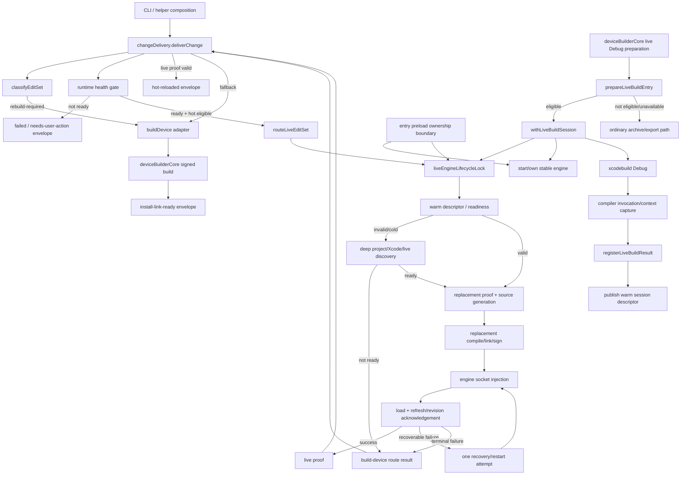
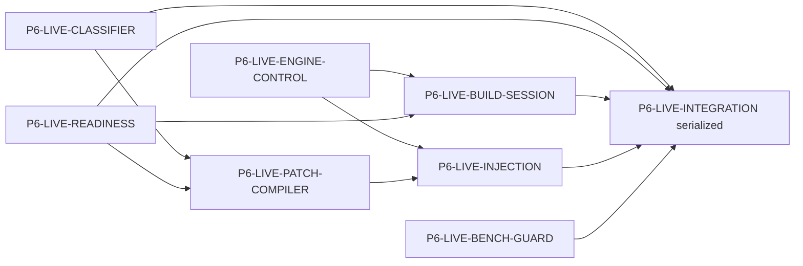

# Phase 6 Live-Reload Decomposition Implementation Map

Status: preparatory architecture map only  
Workstream: `P6-LIVE-DECOMP-PREP`  
Dispatch base: `38eee4bfb1eabc2184d92aa3e52fee28b139cbf5`  
Production routing changed: **no**

This document reverse-maps the live-reload implementation that exists at the
Phase 6 dispatch base. It is intentionally implementation-oriented: future
Phase 6 workers should be able to take one package below without rediscovering
which process, file, lock, descriptor, or benchmark contract another package
owns.

This is not a replacement for the master plan, invariants, execution
amendments, roadmap, registry, agent protocol, hot-reload fast-path plan, or
benchmark plan. Those remain authoritative. This file does not authorize a
production routing switch.

## 1. Executive conclusion

The current live-reload implementation is not one responsibility even though a
large share of it lives in `mac-helper/src/liveReload.js`. Today that module
combines:

1. edit-set normalization and safe classification;
2. project/Xcode/live-readiness discovery;
3. live-engine process/session lifecycle;
4. live-build entry and compiler-context capture;
5. dynamic-replacement proof/source generation and compilation;
6. engine injection, acknowledgement, and one-shot recovery;
7. route-result construction and reason-code reporting; and
8. persistence for engine/compiler/patch state.

Several important responsibilities already sit outside that monolith:

- `changeDeliveryContract.js` owns the stable delivery vocabulary/envelope;
- `changeDelivery.js` owns top-level delivery arbitration, exact in-flight
  deduplication, runtime gating, live-proof validation, and invocation of the
  rebuild adapter;
- `deviceBuilderCore.js` owns the actual signed-build/Xcode build workflow and
  enters the live build session only for the eligible Debug path;
- `liveEngineLifecycleLock.js` owns cross-process lifecycle serialization;
- `liveEngineOwnershipPreload.js` owns the process-identity boundary that makes
  starting/stopping the detached engine safe;
- `liveSessionDescriptor.js` owns the persisted warm-readiness descriptor and
  its freshness/permission checks; and
- the benchmark tree owns the semantic and latency oracle that Phase 6 must not
  weaken.

The safest Phase 6 execution model is therefore **parallel destination-module
construction plus parity characterization, followed by one serialized
production integration package**. Having multiple workers independently edit
`liveReload.js`, `changeDelivery.js`, `deviceBuilderCore.js`, or the production
CLI composition in parallel would create both merge conflicts and hidden
behavioral drift.

## 2. Current source-of-truth inventory

### Production/runtime modules

| Path | Current ownership relevant to Phase 6 |
| --- | --- |
| `mac-helper/src/liveReload.js` | classifier; deep/warm inspection; Xcode/scheme/application-target discovery; engine start/stop/status; live-build session; compiler capture/registration; replacement proof/source generation; patch compile/link/sign; socket injection; acknowledgement polling; one-shot recovery; live route results |
| `mac-helper/src/changeDeliveryContract.js` | stable delivery outcomes/schema and validation |
| `mac-helper/src/changeDelivery.js` | operation-level classifier invocation; per-process exact-request coalescing; runtime health gate; routing; proof validation; invocation of `buildDevice` fallback; compact delivery envelope |
| `mac-helper/src/deviceBuilderCore.js` | real Xcode/signed-build implementation; optional live-enabled Debug build; ordinary archive/export fallback; build-result registration |
| `mac-helper/src/liveEngineLifecycleLock.js` | cross-process `~/.swift-sim/engine/lifecycle.lock`; stale-owner handling; busy error normalization |
| `mac-helper/src/liveEngineOwnershipPreload.js` | detached-engine identity establishment; guarded PID publication/read/termination; process-group ownership; import-order boundary |
| `mac-helper/src/liveSessionDescriptor.js` | warm session descriptor construction/fingerprint/validation/atomic publication |
| `mac-helper/bin/swift-sim-entry.js` | installs live-engine ownership boundary before loading the normal CLI |
| `mac-helper/bin/swift-sim-helper-entry.js` | installs the same ownership boundary before helper startup |
| `mac-helper/bin/swift-sim.js` | production CLI composition for live/delivery commands; later integration seam, not a parallel-edit surface |

### Existing characterization / evidence surfaces

The current tree already has meaningful characterization around the seams that
matter most. Phase 6 should reuse them rather than replacing them with a new,
weaker test vocabulary:

- `test/liveReload.test.js` — classifier and routing/live behavior;
- `test/liveEngineLifecycleLock.test.js` — in-process serialization, stale lock
  reclamation, malformed owner/reclaim records, and exact process identity;
- `test/liveSessionDescriptor.test.js` — persisted warm-session validity and
  freshness behavior;
- change-delivery tests around delivery envelopes, fallback and live proof;
- benchmark runner/corpora under `benchmarks/`, including physical-device
  semantic confirmation; and
- `docs/internal/plans/HOT_RELOAD_BENCHMARK_PLAN.md` as the acceptance contract
  for classifier safety, reliability and latency.

No new production fixture is required in this preparatory lane: the benchmark
corpora already provide a substantially stronger semantic oracle than a small
new synthetic fixture would. Future extraction packages should add focused
parity tests to these existing surfaces.

## 3. Current end-to-end responsibility graph



Two consequences are easy to miss:

- The delivery path classifies before choosing the rebuild fallback. Structural
  edits must stay able to reach the signed-build path without paying live patch
  compilation/injection costs.
- The live-enabled build session and edit injection share the same lifecycle
  lock. That prevents an edit from racing an engine restart or compiler-context
  capture, but it also means moving unrelated work under that lock can directly
  increase hot-path latency.

## 4. Responsibility seams in detail

### 4.1 Source/change classification

**Current owner:** `liveReload.js`, with delivery vocabulary in
`changeDeliveryContract.js`.

Public classifier seams include `classifyEditSet`, compatibility wrappers for
single/multiple live changes, and Swift-source classification. The canonical
input is a complete edit set, not an isolated line diff. A single unsafe member
makes the operation rebuild-safe.

Current safety behavior includes, at minimum:

- non-Swift changes -> rebuild;
- add/delete/rename -> rebuild;
- import/declaration/stored-property/signature/unsupported macro or explicit
  replacement changes -> rebuild;
- mixed hot + structural operation -> rebuild;
- implementation-only Swift changes -> hot eligible; and
- unchanged sources -> no change.

`LIVE_REASON_CODES` and `CLASSIFIER_VERSION` are observable compatibility
surfaces. English text is not the assertion API; reason codes are.

**Stable seam:** a pure typed `classifyEditSet(editSet)` that performs no Xcode,
engine, network, descriptor, or build work.

**Do not regress:** the benchmark has zero tolerance for an expected build edit
being routed live. Recall can improve later; safety cannot be traded for it.

### 4.2 Xcode/project/readiness discovery

**Current owner:** primarily `liveReload.js`, with durable warm state in
`liveSessionDescriptor.js`.

This responsibility discovers/validates the project/workspace, schemes,
application target, live package/interposable configuration, live host/tailnet
conditions, compiler capture, engine session and related prerequisites.

There are intentionally two modes:

1. **warm delivery inspection** — validate the previously published session
   descriptor and current engine/compiler/configuration fingerprints; and
2. **deep/cold inspection** — perform the more expensive project/Xcode/live
   discovery required to establish or repair readiness.

The session descriptor records project/scheme/target information, engine nonce
and version, compiler-capture fingerprint, configuration fingerprints, host and
related readiness. Publication is atomic, permission-restricted, and rejects a
stale writer whose generation would move state backward.

**Stable seam:** `inspectWarmLiveReadiness(context)` must be cheap and side
free; `inspectDeepLiveReadiness(context, dependencies)` may perform Xcode and
system probes. The result type must make `warm`, `cold`, `invalid`, and
user-action/rebuild outcomes explicit.

**Do not regress:** never silently replace warm descriptor validation with a
fresh `xcodebuild -list`, target scan, package scan, or other process spawn on
every implementation-only edit.

### 4.3 Xcode/build orchestration and compiler-context capture

**Current owners:** `deviceBuilderCore.js` plus the live-build entry/session
functions presently in `liveReload.js`.

The device builder has two materially different paths:

- an eligible live-enabled Debug build enters a live build session, keeps the
  engine/session coordinated, executes the Debug Xcode build, captures the
  compiler context needed for subsequent patch compilation, registers the
  successful build, and publishes warm readiness; and
- a build that cannot/should not enter that path continues through the ordinary
  signed archive/export workflow.

This distinction must remain visible after extraction. “Live preparation was
unavailable” is not permission to mutate the ordinary build semantics.

**Stable seam:** a live-build-session adapter with explicit `prepare`,
`runWithinSession`, and `registerResult` responsibilities. `deviceBuilderCore`
remains the owner of actual signed-build mechanics.

**Synchronization contract:** session entry, engine lifecycle, compiler capture
and build-result publication must remain ordered relative to edit injection.
The current lifecycle lock supplies that ordering.

### 4.4 Engine/session ownership

**Current owners:** engine control inside `liveReload.js`, the lifecycle lock,
ownership preload, and session descriptor.

The stable engine is a latency feature and a correctness boundary. Its durable
state currently includes:

```text
~/.swift-sim/engine/
  InjectionNext.app/
  manifest.json
  engine.pid
  session.json
  lifecycle.lock/

~/.swift-sim/live/
  engine.sock
  engine.log
  compilations.json
  patches/
  session-descriptor.json
```

`liveReload.js` currently treats the engine-control request timeout as 750 ms
and compiler registration as a bounded 5 s operation. Start/status/recovery
also use bounded polling rather than unbounded waits.

The preload is not incidental. Production entrypoints install
`installLiveEngineOwnershipBoundary()` before the normal CLI/helper module is
loaded. It guards detached engine spawn, turns PID publication into a durable
identity record, validates kernel start token/executable/instance nonce, and
only authorizes termination of the exact owned process group. Future Phase 5
preload removal may change how this guarantee is implemented, but Phase 6 must
not bypass it while it remains current.

**Stable seam:** engine lifecycle operations (`status/start/stop/recover`) must
be process-identity-safe and must not expose raw “kill this PID” authority to a
higher layer.

### 4.5 Patch/proof generation

**Current owner:** `liveReload.js`.

For an implementation-only edit, the router does more than compile arbitrary
new Swift. It derives replacement/proof material from the before/after sources,
generates replacement source, reuses captured compiler context, builds the
replacement artifact, and prepares the metadata needed to prove that the
running process can accept it.

The compiler-context dependency is why patch generation cannot be treated as a
standalone source transformer disconnected from build-session state.

**Stable seam:**

```text
preparePatch(editSet, compilerContext, projectContext)
  -> { artifact, mode, replacementMetadata, requestMetadata }
```

The patch compiler may read a validated compiler-context snapshot and create
artifacts under its own patch workspace. It should not start/stop the engine or
select the rebuild fallback.

**Do not regress:** do not introduce a regular Xcode build, dependency resolve,
or new engine process into `preparePatch` for a warm edit.

### 4.6 Injection, proof validation, delivery and fallback

**Current owners:** injection/routing in `liveReload.js`; operation-level policy
in `changeDelivery.js`; actual fallback build in the injected `buildDevice`
adapter implemented by the device builder.

`changeDelivery.deliverChange` currently:

1. hashes the complete operation and coalesces an identical in-flight request
   within the process;
2. classifies once;
3. runs the runtime-health gate;
4. invokes the signed-build adapter immediately for a rebuild-required edit;
5. otherwise calls the live router while injecting the already computed
   classification so it is not recomputed;
6. accepts “hot-reloaded” only when the route result contains a valid live proof
   (successful patch, applied replacement/interposition, refresh acknowledgement
   and a positive revision); and
7. invokes the signed-build adapter if live routing cannot produce that proof.

This module therefore owns **delivery arbitration**, but not Xcode mechanics.
It is also an externally observable compact-result boundary: non-verbose
results are size bounded and errors are sanitized.

The live router/injector owns request-to-engine communication, load/refresh
acknowledgement and a bounded recovery attempt. Recovery must remain finite and
observable; a failed recovery falls back rather than looping indefinitely.

**Stable seams:**

- `injectPatch(engineSession, preparedPatch) -> acknowledgement`
- `validateLiveProof(acknowledgement) -> proof`
- `decideDelivery(classification, readiness, proof/failure) -> delivery lane`

Only the top delivery layer may invoke the build adapter. Lower patch/engine
modules should return typed failures, not start builds themselves.

### 4.7 Shared state and synchronization

There are three distinct synchronization mechanisms and they must not be
collapsed accidentally:

| Mechanism | Scope | Purpose |
| --- | --- | --- |
| `activeDeliveries` in `changeDelivery.js` | one Node process | coalesce the exact same in-flight delivery request |
| `~/.swift-sim/engine/lifecycle.lock` | cross-process | serialize engine lifecycle/build-session/injection operations that must not race |
| descriptor generation + atomic rename | cross-process persisted state | prevent torn descriptor writes and reject stale publication |

The lifecycle lock has a 120 s default wait, uses process identity from the
ownership layer, quarantines/reclaims stale ownership, and normalizes lock busy
to `SWIFT_SIM_LIVE_ENGINE_BUSY`. Tests specifically cover malformed/stale
records and replacement-lock races.

A future decomposition must preserve lock *coverage*, not merely keep the lock
file. Releasing the lock before compiler-context publication can let a patch
compile against stale state. Conversely, moving classification, unrelated
runtime checks, or other cold work under the lock increases queueing and can
regress p95.

## 5. Hot path versus cold/build path

### Warm implementation-only edit

```text
edit operation
  -> classify once
  -> runtime health
  -> validate warm live descriptor/session
  -> serialize required live lifecycle section
  -> generate replacement proof/source
  -> compile/link/sign replacement with captured compiler context
  -> inject into already-running engine/app
  -> correlate apply + refresh + revision acknowledgement
  -> return compact hot-reloaded proof
```

The long-lived engine, already-installed Debug app, compiler capture and warm
session descriptor are all preconditions of the intended latency.

### Structural/resource/mixed edit

```text
edit operation
  -> classify once
  -> runtime health
  -> signed build adapter
  -> deviceBuilderCore normal build/archive/export path as appropriate
  -> install-link-ready result
```

Do not force structural edits through deep live-readiness or patch work before
this fallback.

### Live-enabled build establishment

```text
device build requested
  -> test eligibility / prepare live build entry
  -> if eligible: enter lifecycle-serialized live build session
       -> establish/reuse engine
       -> perform Debug build
       -> capture/register compiler context
       -> register live build result
       -> publish warm descriptor
  -> otherwise: ordinary signed build path
```

## 6. Error and recovery behavior that forms part of the contract

| Failure class | Current expected behavior | Extraction requirement |
| --- | --- | --- |
| unsafe/ambiguous edit | rebuild-safe classification | fail closed before patching |
| runtime/helper unavailable | failed or needs-user-action delivery envelope | do not disguise as patch failure |
| warm descriptor missing/stale | cold/deep readiness or rebuild-safe result | no stale compiler/session use |
| engine control timeout/busy | typed live failure | bounded wait; preserve busy semantics |
| patch compile failure | live failure -> fallback | no partial “success” proof |
| load failure | recovery where allowed, then fallback | one bounded recovery policy |
| refresh not acknowledged | not a live success | proof requires refresh acknowledgement |
| missing/zero revision | not a live success | proof requires positive correlated revision |
| engine identity mismatch | fail closed | never signal an unowned/reused PID |
| stale descriptor writer | publication rejected | never roll generation backward |
| live build entry unavailable | ordinary build path | do not make the build depend on live readiness |
| partial/contaminated benchmark state | stop/rebuild baseline before continuing | never count a contaminated success |

## 7. Benchmark-sensitive contracts

The benchmark plan is the no-regression oracle for Phase 6. In particular:

- an expected `build-device` edit predicted live is a dangerous false-live;
  accepted count is **zero**;
- headline physical-device latency begins immediately before invoking the route
  operation and ends only when the expected semantic marker from changed code is
  observed on the iPhone;
- the current release targets are at least **99% confirmed reliability** over
  three warm passes, **p50 <= 1,000 ms**, **p95 <= 2,000 ms**, zero false success
  reports, and zero unhandled partial multi-file states; and
- an acknowledgement that merely says “library loaded” is insufficient. The
  benchmark requires correlated applied/refresh/revision evidence and the
  semantic marker.

### Naive extraction patterns that can regress latency

1. Calling Xcode scheme/target discovery on every edit instead of trusting a
   valid warm descriptor.
2. Starting a fresh live engine for every patch.
3. Re-running a normal Debug/archive build to obtain compiler flags for every
   patch instead of reusing captured compiler context.
4. Classifying once in `changeDelivery` and again in the router/extracted
   classifier.
5. Serializing unrelated runtime checks or classifier work behind the lifecycle
   lock.
6. Replacing direct in-process calls with subprocess/CLI round trips between
   newly extracted modules.
7. Re-reading/hash-fingerprinting more project files than the current warm
   descriptor contract requires.
8. Moving build fallback behind a failed deep-live probe for changes already
   known to require a build.
9. Adding synchronous logging/JSON pretty-printing to the measured route path.
10. Publishing/re-reading persistent state between every sub-step where current
    code passes the value in memory.

### Naive extraction patterns that can regress correctness

1. Splitting the live-build session from compiler capture without preserving the
   lifecycle lock coverage/order.
2. Treating `engine.pid` as a raw PID and bypassing the ownership preload's
   start-token/executable/nonce validation.
3. Letting patch compilation select its own scheme/target independently of the
   descriptor/compiler capture.
4. Accepting patch load without refresh/revision proof.
5. Retrying indefinitely or retrying a partial multi-file patch without first
   knowing the app state.
6. Letting a stale descriptor publication overwrite a newer generation.
7. Giving lower layers authority to invoke signed builds, creating competing
   fallback owners.
8. Changing reason-code/envelope semantics while moving code.

## 8. Characterization matrix for the split

Each extracted destination module must be proven against the current public or
fixture-visible behavior before the serialized production rewire.

| Seam | Minimum parity characterization |
| --- | --- |
| classifier | current corpus + focused before/after source cases; reason-code equality; zero dangerous false-live |
| readiness | valid warm descriptor, changed project/scheme/config fingerprint, changed compiler capture, changed engine nonce/version, missing/malformed descriptor, permission/symlink rejection |
| build session | live-eligible Debug entry, ineligible entry, engine/session setup failure, compiler capture registration failure, restart/retry ordering |
| engine control | already running, cold start, stale PID/identity, busy lifecycle lock, bounded status timeout, safe stop/recovery |
| patch compiler | single-file implementation body, multi-file implementation edits, compile failure, stale/missing compiler context, artifact containment, deterministic metadata |
| injection/delivery | load success + refresh + revision, load failure, no refresh ack, zero/stale revision, recover-once success, recover-once failure -> fallback, identical in-flight request coalescing |
| full benchmark | classifier safety scoreboard unchanged; warm semantic physical-device result and latency distribution not regressed |

No Phase 6 package may “fix” an existing behavior simply because its extracted
version looks cleaner. Behavior changes require a separately justified change
with benchmark evidence.

## 9. Proposed disjoint Phase 6 implementation packages

The packages below are intentionally defined so parallel workers can **add their
new destination modules and focused parity tests without editing the production
monolith or shared composition files**. The serialized integration package then
rewires the production exports once all destinations are proven.

### P6-LIVE-CLASSIFIER — pure edit classification

**Owns new paths**

- `mac-helper/src/liveChangeClassifier.js`
- `test/liveChangeClassifier.test.js`

**Move/capture later from** `liveReload.js`: edit normalization, declaration
surface comparison, source classifier, classifier version/reason production.

**May depend on:** `changeDeliveryContract.js` or a narrow shared reason-code
module chosen by the integrator.

**Must not touch in parallel:** `liveReload.js`, `changeDelivery.js`, CLI,
`deviceBuilderCore.js`.

**Acceptance:** parity with current `classifyEditSet` on existing cases/corpus;
zero dangerous false-live; no runtime/system I/O.

### P6-LIVE-READINESS — warm and deep readiness discovery

**Owns new paths**

- `mac-helper/src/liveReadiness.js`
- `test/liveReadiness.test.js`

**Move/capture later from** `liveReload.js`: project/workspace/scheme/application
configuration, warm-vs-deep inspection, Xcode discovery helpers and readiness
result construction.

**Consumes, does not replace:** `liveSessionDescriptor.js`.

**Must not own:** engine start/stop, patch compilation, signed-build fallback.

**Acceptance:** warm valid path requires no avoidable deep Xcode discovery;
stale/missing descriptors follow current cold/fail-closed semantics; dependency
injection makes Xcode/system probes deterministic in tests.

### P6-LIVE-BUILD-SESSION — live Debug build/session and compiler capture

**Owns new paths**

- `mac-helper/src/liveBuildSession.js`
- `test/liveBuildSession.test.js`

**Move/capture later from** `liveReload.js`: `prepareLiveBuildEntry`,
`withLiveBuildSession`, compiler invocation/capture registration and
`registerLiveBuildResult` behavior.

**Consumes:** existing lifecycle lock, engine-control interface, descriptor
publisher.

**Must not touch in parallel:** `deviceBuilderCore.js`. The serialized
integration package will replace its imports/calls after parity is proven.

**Acceptance:** preserves lock ordering across engine/session establishment,
Debug build callback, compiler capture, build-result registration and descriptor
publication; live preparation failure leaves the ordinary build available.

### P6-LIVE-ENGINE-CONTROL — engine process/session mechanics

**Owns new paths**

- `mac-helper/src/liveEngineControl.js`
- `test/liveEngineControl.test.js`

**Move/capture later from** `liveReload.js`: engine install/status/start/stop,
socket/control requests and bounded restart/recovery primitives.

**Consumes, does not modify in parallel:** `liveEngineLifecycleLock.js` and
`liveEngineOwnershipPreload.js`.

**Must not own:** source classification, Xcode discovery, patch compilation, or
build fallback.

**Acceptance:** stable-engine reuse; exact current identity/lock safety;
bounded timeouts; no raw PID termination path.

### P6-LIVE-PATCH-COMPILER — replacement proof and artifact production

**Owns new paths**

- `mac-helper/src/livePatchCompiler.js`
- `test/livePatchCompiler.test.js`

**Move/capture later from** `liveReload.js`: replacement/proof derivation,
replacement source generation, compiler invocation adaptation, compile/link/sign
and patch artifact/manifest preparation.

**Inputs:** classified implementation-only edit set + validated compiler/project
context.

**Outputs:** prepared patch + replacement metadata or typed compile/proof
failure.

**Must not own:** engine lifecycle or fallback builds.

**Acceptance:** deterministic parity on current supported implementation edits;
fail closed on missing/stale compiler context; no Xcode build on the warm patch
path; generated files remain contained in the live patch workspace.

### P6-LIVE-INJECTION — injection, acknowledgement and recovery policy

**Owns new paths**

- `mac-helper/src/livePatchInjection.js`
- `test/livePatchInjection.test.js`

**Move/capture later from** `liveReload.js`: inject request, status polling,
request correlation, load/refresh/revision acknowledgement, and the current
single bounded recovery/retry policy.

**Consumes:** engine-control interface and prepared patch.

**Returns:** typed success proof or typed failure; it never invokes the signed
build adapter.

**Acceptance:** no success without applied + refresh + positive revision proof;
recover once where current behavior permits; terminal failure is returned to
higher delivery policy.

### P6-LIVE-BENCH-GUARD — characterization/performance guardrails

**Owns only test/benchmark support paths selected by that worker**, with no
production composition edits.

Responsibilities:

- add a decomposition parity runner/fixtures only where current coverage cannot
  compare the legacy and extracted seams;
- record classifier reason-code parity;
- ensure the warm path can assert that forbidden deep probes were not invoked;
- preserve benchmark timestamp boundaries; and
- provide a before/after report shape for serialized integration.

This package must not invent a substitute performance score. The existing
physical-device semantic benchmark remains authoritative.

### P6-LIVE-INTEGRATION — serialized production rewire (NOT parallel)

This is the only package that should edit the overlapping production surfaces:

- `mac-helper/src/liveReload.js`;
- `mac-helper/src/changeDelivery.js` if import/re-export cleanup is needed;
- `mac-helper/src/deviceBuilderCore.js`;
- `mac-helper/bin/swift-sim.js` or entry composition if required; and
- architecture ownership policy/budgets when the split becomes production.

Integration order:

1. pin parity heads of all six parallel packages;
2. re-export/delegate classifier behavior from the compatibility surface;
3. delegate readiness;
4. delegate engine control and build session while preserving preload/lock
   ordering;
5. delegate patch compile and injection;
6. retain `liveReload.js` compatibility exports until callers are migrated;
7. migrate callers without changing delivery reason/envelope semantics;
8. remove duplicate legacy implementations only after parity tests pass;
9. run full local verification and physical-device benchmark evidence required
   by the governing plans; and
10. only then consider any separately authorized production routing/authority
    switch.

## 10. Package dependency graph



The arrows describe **semantic dependencies**, not permission for parallel
workers to consume unmerged implementation branches. During parallel work each
package should use a small injected interface/fake matching the contract above.
The serialized integrator resolves the real imports after all heads exist.

## 11. Red-zone / serialized ownership for future agents

Parallel Phase 6 workers must leave these alone unless their dispatch explicitly
makes them the serialized integrator:

- production CLI/helper composition;
- the authority/preload ordering at production entrypoints;
- `changeDelivery.js` top-level orchestration;
- `deviceBuilderCore.js` production build composition;
- the body/removal of `liveReload.js`;
- canonical master plan/invariants/amendments/roadmap/registry/progress/handoff
  documents;
- global architecture-policy ownership/budget changes; and
- any production route/authority switch.

This rule is what makes the six packages above actually parallelizable.

## 12. Integration acceptance checklist

A later Phase 6 integration is not complete merely because files are smaller.
It must demonstrate all of the following:

- classifier reason-code behavior is unchanged or separately justified with
  corpus evidence;
- zero dangerous false-live benchmark cases;
- structural/resource/mixed changes still reach signed-build fallback without
  unnecessary live work;
- valid warm edits do not add deep Xcode discovery or engine respawn;
- engine/session ownership still passes the process-identity and lifecycle-lock
  tests;
- compiler context cannot race live build registration/restart;
- patch success still requires applied + refresh + positive revision proof;
- recovery remains bounded and fallback remains available;
- identical in-process deliveries remain coalesced;
- compact delivery envelopes remain valid/sanitized;
- warm physical-device semantic confirmation remains valid;
- benchmark timestamp boundaries are unchanged;
- measured p50/p95/reliability are reported, not inferred from unit tests; and
- no production routing authority is switched by the preparatory/parallel
  extraction itself.

## 13. Handoff summary

The principal extraction risk is not discovering where to put functions. It is
preserving the **temporal contract** between warm readiness, the stable engine,
compiler context, the lifecycle lock, injection proof, and signed-build
fallback. Phase 6 should treat those timing/order relationships as architecture.

The six parallel packages above can build isolated destination modules and
characterization without sharing production edit surfaces. One serialized
integration package can then replace the monolith behind its existing exports
and callers. That is the lowest-conflict path to decomposition while preserving
the current benchmark-defined latency and correctness behavior.